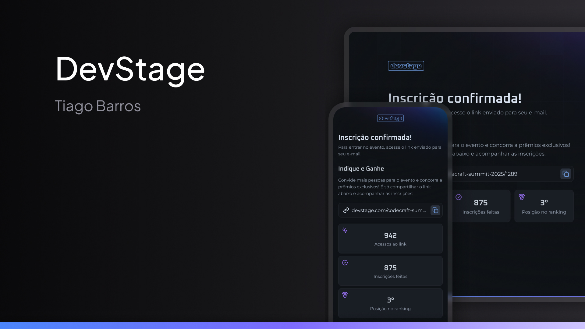

<h1 align="center"> 🔗 DevStage - Invite Links </h1>

<p align="center">
  
</p>

<br>

<p align="center">
  
</p>

## 🛠 Technologies  
- **Next.js**  
- **React**  
- **TypeScript**  
- **TailwindCSS**  
- **API REST**  
- **Docker**
- **PostgreSQL**

## 📌 About  
**DevStage** was developed using React and Next.js to create an invite sharing application. The application allows users to register, generate a unique link, and share it with others.

## 🌎 View The Project On-line
You can access the project at: <br>
🔗 [DevStage](https://meusite.com)

## 📦 Installation and Use
Clone the repository and install the dependencies:
```bash
git clone https://github.com/tiagobarross/DevStage.git
cd DevStage
npm install
```

## 🔧 Running the Project Locally
Inicie o servidor de desenvolvimento:
```bash
npm run dev
```

## :memo: License

This project is licensed under the MIT License.
